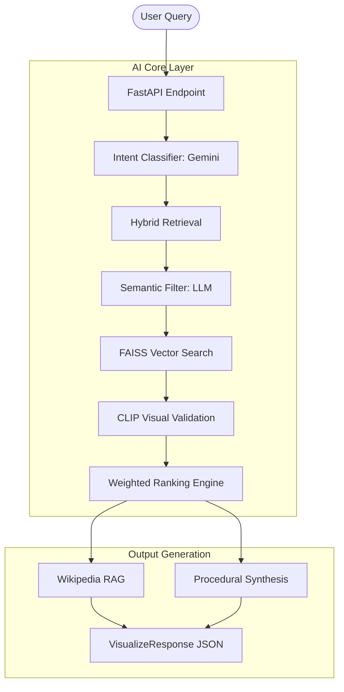

# 🌌 AI 3D Visualizer & Retrieval Engine

A research-grade AI backend that transforms text queries into rich 3D visualizations. This system combines **Hybrid Search**, **Multimodal AI Validation**, and **LLM Semantic Reasoning** to deliver high-quality 3D assets and procedural scenes.

---

## 🚀 Key Features

### 🧠 Intelligent Pipeline
- **Intent Classification**: Uses Gemini to categorize user queries (e.g., Monument, Science, Nature) and prioritize the most relevant data sources.
- **Semantic Filtering**: LLM gatekeeper that removes irrelevant search results (e.g., ignores "air conditioner" for "solar system" searches).
- **CLIP Validation**: Multimodal visual-semantic alignment using OpenAI's **ViT-B-32** model to ensure models *look* like what the user asked for.
- **Weighted Ranking**: A custom engine that balances CLIP similarity (50%), Vector similarity (35%), Keywords (10%), and Data Quality (5%).

### 🛠️ Technical Prowess
- **Hybrid Retrieval**: Targeted search across **Sketchfab**, **Poly Haven**, and Internal Datasets.
- **RAG Integration**: Real-time Wikipedia lookup to provide educational context and descriptions for every model.
- **Procedural Synthesis**: Fallback engine that generates complete 3D scene blueprints via Gemini if no physical model is found.
- **Cloud Optimized**: Dockerized and optimized for Google Cloud Run with **CPU-only PyTorch**, resulting in lean container sizes and fast cold starts.

---

## 🏗️ System Architecture



---

## 🛠️ Tech Stack
- **Framework**: FastAPI
- **AI/ML**: Google Gemini (LLM), OpenAI CLIP (Vision), SentenceTransformers (Embeddings)
- **Vector DB**: FAISS (Facebook AI Similarity Search)
- **Infrastructure**: Docker, Google Cloud Run, Cloud Build, Google Cloud Storage
- **Languages**: Python 3.10+, JavaScript (Demo UI)

---

## 🚀 Getting Started

### 1. Prerequisites
- Python 3.10+
- Google Cloud SDK (`gcloud`)
- API Keys for **Gemini** and **Sketchfab** (Free tiers available)

### 2. Installation
```bash
git clone https://github.com/veeresh0804/Sankalp-Pramana.git
cd ai-3d-backend
pip install -r requirements.txt
```

### 3. Local Run
```bash
# Add keys to .env
uvicorn main:app --host 0.0.0.0 --port 8080
```

### 4. Cloud Deployment
```bash
# Secure one-click deployment
gcloud run deploy ai-3d-backend --image gcr.io/YOUR_PROJECT/ai-3d-backend
```

---

## 📊 Demo & Verification
- **Swagger Docs**: `/docs`
- **Health Check**: `/health`
- **Interactive Demo**: Open `demo.html` in your browser to test the live API with queries like *"taj mahal"*, *"human heart"*, or *"f1 car"*.

---

## ⚖️ License
Research Project / CC0.

*“Turning concepts into coordinates.”*
